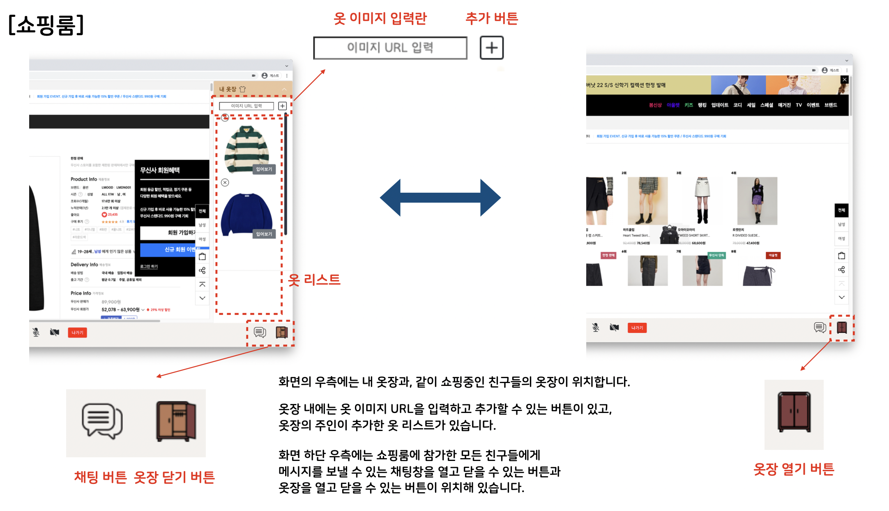
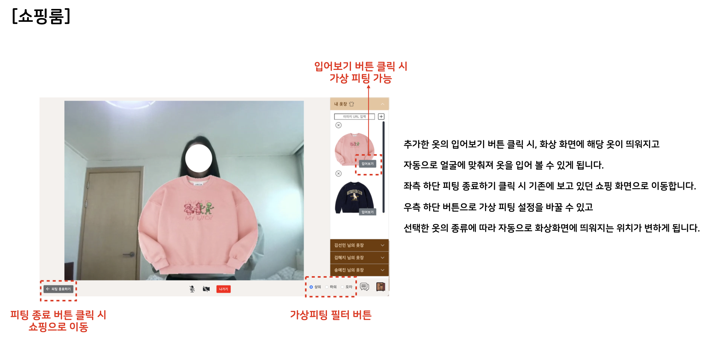
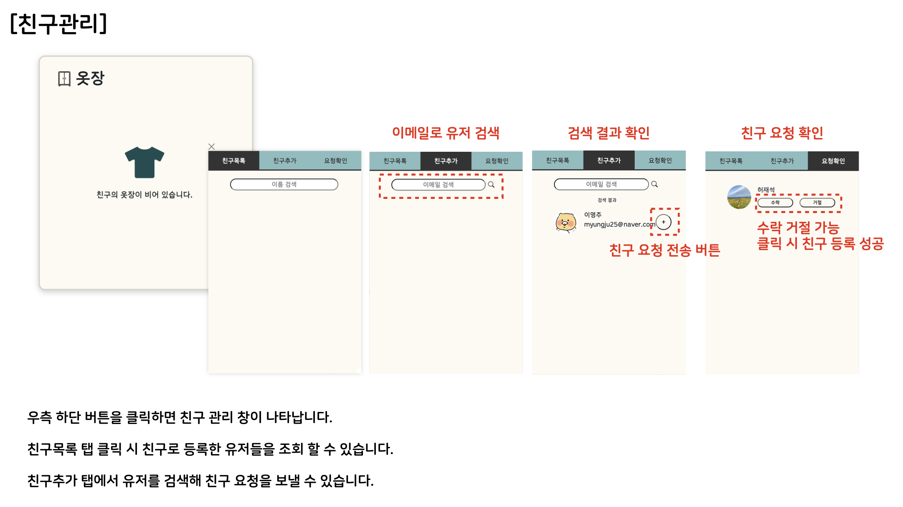
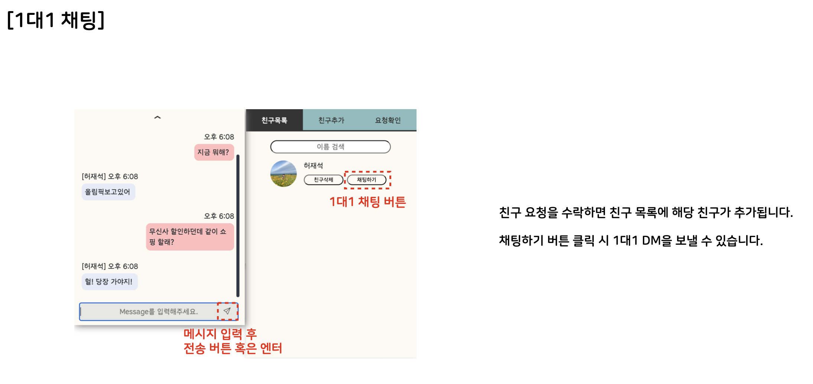
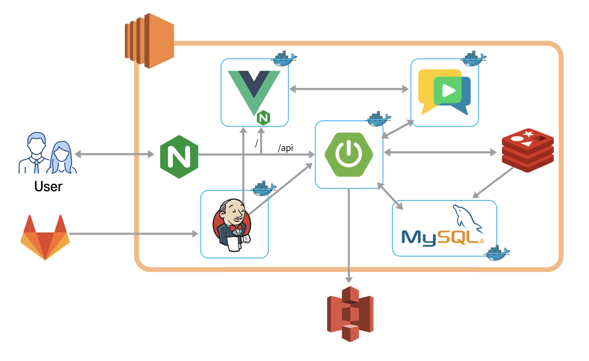

# 👗 FitShare

> FitShare는 성장하고 있는 이커머스 시장에 맞춰, **가상 피팅 기능**을 제공하는 서비스입니다.  
> 사용자들은 함께 온라인 쇼핑을 하며 입어보고 공유해, 오프라인 쇼핑의 장점을 온라인에서도 경험할 수 있습니다.

## ✨ 주요 기능

- 피팅을 원하는 옷을 담아둘 수 있는 `옷장` 기능

  

- 옷장에 담아두었던 상품을 입어볼 수 있는 `가상 피팅`

  

- SNS적 요소인 친구를 맺고 채팅할 수 있는 `친구` 기능

  
  

## 🗓 진행 기간

2022.01.03 ~ 2022.02.18 (총 7주)

## 🖊️ 팀원 소개

- Backend : 김혜지, 송예진, 이명주

- Frontend : 김명섭, 김선민, 허재석

## 🔨 기술스택

### 프론트엔드

- Node.js - v16.13.1
- HTML 5, CSS3, JavaScript (ES6)
- Vue.js 3

### 백엔드

- Java - openjdk v1.8.0_192
- Spring Boot - v2.5.7
- JPA, QueryDSL
- MySQL - v8.0.27
- Swagger - v3

### Infra

- AWS EC2 Ubuntu 20.04
- Jenkins - [ jenkins/jenkins:lts ]
- Nginx - nginx/1.18.0 (Ubuntu)
- Docker - v20.10.12

## 🏭 아키텍처



## 🏗 설치 및 실행

- 프로젝트를 clone 합니다.

  ```
  $ git clone https://github.com/hengzizng/FitShare.git
  ```

### 백엔드

- `Dump20220217.sql` 파일을 통해 로컬 MySQL에 DB 스키마를 생성합니다.

- `application-prod.properties` 의 `spring.datasource.username` 과 `spring.datasource.password` 항목들을 로컬 MySQL에 만들어둔 정보에 맞춰 변경합니다.

- backend 프로젝트를 빌드합니다.

  ```
  $ cd backend
  $ ./gradlew clean build
  ```

- `./gradlew: command not found` 오류가 발생한다면 gradlew에 실행 권한을 부여해줍니다.

  ```
  $ chmod +x gradlew
  ```

- 생성된 jar 파일로 프로젝트를 실행합니다.

  ```
  $ java -jar build/libs/backend-0.0.1-SNAPSHOT.jar
  ```

- 서비스 swagger 주소에 접속해 실행을 확인합니다.

  - http://localhost:8081/swagger-ui/

### 프론트엔드

- frontend 폴더 내부에서 node_modules 를 설치합니다.

  ```
  $ cd frontend
  $ npm install
  ```

- frontend 프로젝트를 실행합니다.

  ```
  $ npm run serve
  ```

- 서비스 주소에 접속합니다.

  - http://localhost:8080
